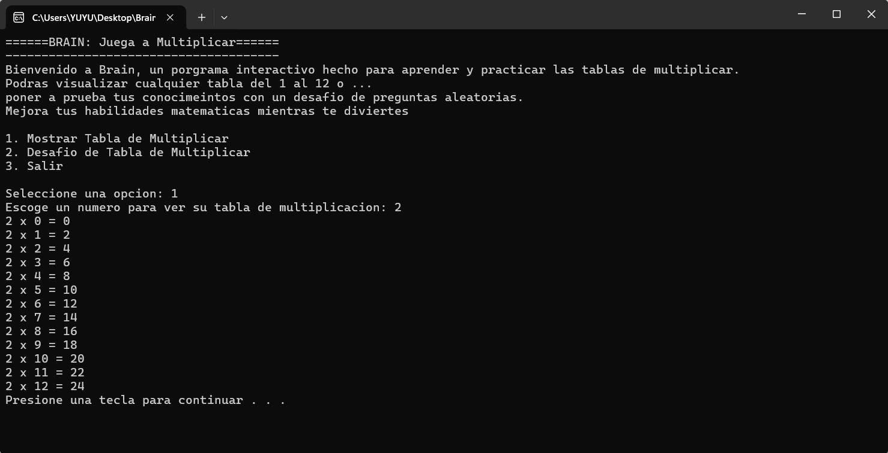
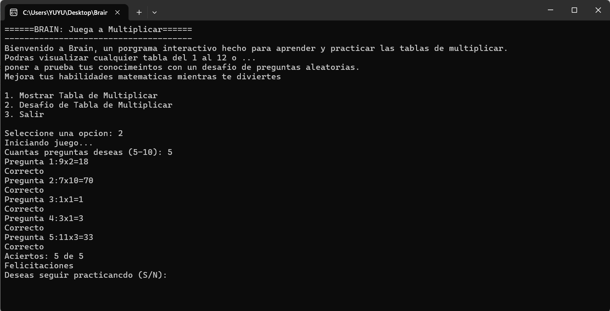
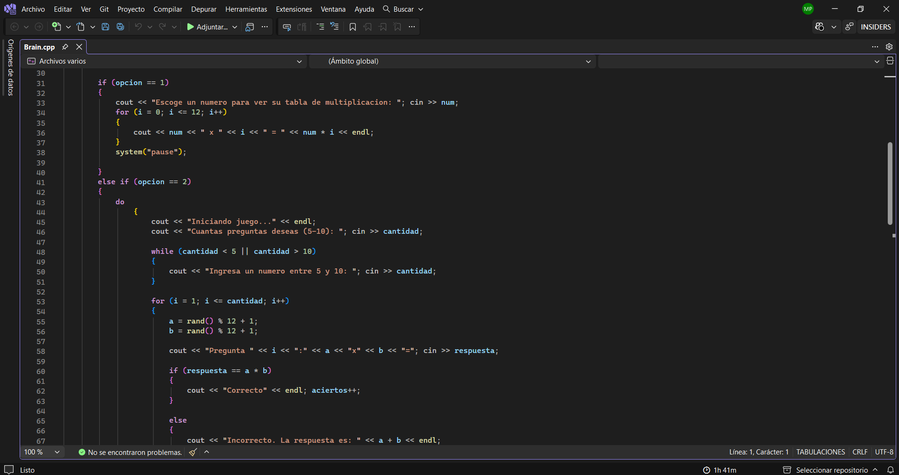

# Brain
Brain is an interactive C++ console program designed to help users practice and improve their multiplication skills. It provoides a simple and dynamic learning experience where users can study multiplication tables form 1 to 12 or test their Knowledge trough a randomized challenge mode.

The program is intended as an educational tool that combines learning and practice, offering inmediate feedback and performance evaluation to help users track their progress.

## Features
Brain includes a main menu that allows users to easily navigate between different options. In the first option, the user can view the multiplication table of any number form 1 to 12, with results displayed in an ordered format.

In the second option, the user enters a challenge mode where random multiplication problems are generated using numbers from 1 to 12. The system evaluates each answer in real time, indicating whether it is correct or incorrect and showing the correct answer is calculated and the user's performance is displayed as a percentage, along with a motivational message base on their result.

Finally, the program allows users to repeat the experience or exit with confirmation, making the interaction more controlled friendly.

## Concepts used
- Variables (integers and characters)
- Conditional structures (if, else if, else)
- While loop (for the main menu)
- For loop (for the multiplication table and challenge mode)
- Random number generation (rand)
- User input validation
- Basic mathematical operations (multiplication and percentage calculation)
- Program flow control via interactive menu

## Possible Improvements
- Add difficulty levels (easy, medium, hard) to increase or decrease the complexity of the multiplication problems.
- Store user scores in a file to keep track of progress over time.
- Implement a ranking system to compare performance between different users or sessions.
- Add a timer for each question to increase the challenge and improve reaction speed.
- Expand the game to include other arithmetic operations such as addition, subtraction, and division.
